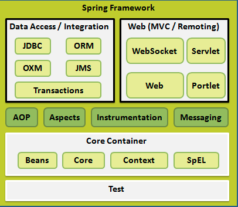

# spring framework
## spring 的体系



### spring的核心容器
>心容器由**spring-core，spring-beans，spring-context，spring-context-support和spring-expression**（SpEL，Spring表达式语言，Spring Expression Language）等模块组成

* spring-core模块提供了框架的基本组成部分，包括 IoC 和依赖注入功能。

* spring-beans 模块提供 BeanFactory，工厂模式的微妙实现，它移除了编码式单例的需要，并且可以把配置和依赖从实际编码逻辑中解耦。

* context模块建立在由core和 beans 模块的基础上建立起来的，它以一种类似于JNDI注册的方式访问对象。Context模块继承自Bean模块，并且添加了国际化（比如，使用资源束）、事件传播、资源加载和透明地创建上下文（比如，通过Servelet容器）等功能。Context模块也支持Java EE的功能，比如EJB、JMX和远程调用等。ApplicationContext接口是Context模块的焦点。spring-context-support提供了对第三方库集成到Spring上下文的支持，比如缓存（EhCache, Guava, JCache）、邮件（JavaMail）、调度（CommonJ, Quartz）、模板引擎（FreeMarker, JasperReports, Velocity）等。

* spring-expression模块提供了强大的表达式语言，用于在运行时查询和操作对象图。它是JSP2.1规范中定义的统一表达式语言的扩展，支持set和get属性值、属性赋值、方法调用、访问数组集合及索引的内容、逻辑算术运算、命名变量、通过名字从Spring IoC容器检索对象，还支持列表的投影、选择以及聚合等。

### spring 依赖注入
* 1 属性注入

* 2 构造方法注入

### bean 的作用域

|作用域|描述|
|------ | ------ |
|singleton|在spring IoC容器仅存在一个Bean实例，Bean以单例方式存在，默认值|
|prototype|每次从容器中调用Bean时，都返回一个新的实例，即每次调用getBean()时，相当于执行newXxxBean()|
|request|每次HTTP请求都会创建一个新的Bean，该作用域仅适用于WebApplicationContext环境|
|session|同一个HTTP Session共享一个Bean，不同Session使用不同的Bean，仅适用于WebApplicationContext环境|
|global-session|一般用于Portlet应用环境，该运用域仅适用于WebApplicationContext环境|

* bean-scope.xml
```java
  <!--单例-->
    <bean id="studentSing" class="entity.Student" scope="singleton">
        <property name="id" value="1"/>
        <property name="username" value="zhangsan"/>
    </bean>

    <!--多例-->
     <bean id="studentPro" class="entity.Student" scope="prototype">
        <property name="id" value="1"/>
        <property name="username" value="lisi"/>
    </bean>
```
* 测试代码
``` java
    // 测试单例模式
    ApplicationContext applicationContext = new ClassPathXmlApplicationContext("bean-scope.xml");
    Student studentA = (Student) applicationContext.getBean("studentSing");
    Student studentB = (Student) applicationContext.getBean("studentSing");
    System.out.println(studentA == studentB);
    System.out.println("---------Singleton-----");
    Student studentC = (Student) applicationContext.getBean("studentPro");
    Student studentD = (Student) applicationContext.getBean("studentPro");
    System.out.println(studentC == studentD);
```
